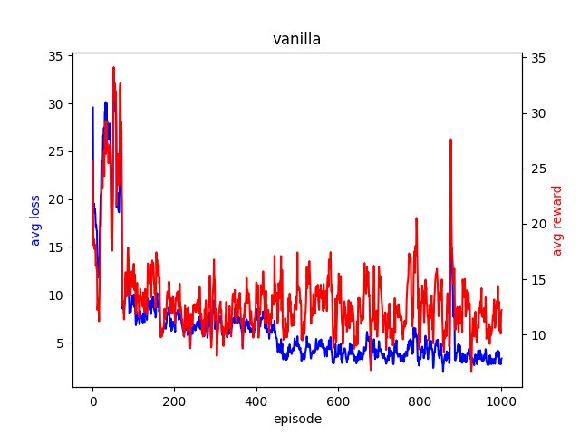

# Solving the Halite Challenge with a Deep-Q network

## Introduction

For our final project in the course of “Implementing ANN with TensorFlow” we decided to revive the challenge proposed by TWO SIGMA in 2016. The challenge was composed of the provided game “[Halite](https://2016.halite.io/index.html)” and its corresponding rule set. The competition then started in November 2016 and finalized 3 month later, in February 2017. The send in application were a mix of different approaches, consisting of C#, python, java scripts etc. But also some Machine Learning based bots. In our growing interest in self learning systems we formulated our idea to challenge the competition with an ANN based bot. In this report we will show our different approaches, our successful as well as our not so successful ones.

### The Rules

Halite is played on a rectangular grid, where the size correlates with the number of players (2-6). The goal is to seize the means of production. Each player starts on a specific tile of the grid, all other tiles are considered unowned. The tiles come in different qualities. A tile produces or enhances one drone per turn with the strength of its quality value. Drones have the ability to move in cityblock distance or to stay at their momentary tile. An unowned tile can be converted into an owned one by being occupied by a drone. The strength of the drones is capped to the value of 255. Tiles owned by foreign drones can be conquered by overwhelming through higher strength. The strength values get subtracted. When all enemy drones and tiles are conquered, the game ends. The map is continuous, go to far left and you will appear on the right (bottom and top the same).

## Our Goal

The Goal of our final project was to train a Reinforcement Learning Deep Q Network to play this game in a sufficient efficient way.

### Whats a Deep-Q network (DQN)?

A DQN is a reinforcment learning(RL) based convolutional neural network(CNN). RL is about training an agent to interact with its environment to achieve a certain goal. To achieve said goals the agent has to decide on an action  which then leads to certain states . These actions can impact the reward in a positive or negative way. The agent's purpose is, to maximize the reward in each episode. An episode is anything between the first state and the terminal state. We reinforce the agent to learn to perform the most rewarding action by experience. How rewarding an action can be is not obvious in most scenarios. Therefore a Markov decision process is initiated to save every action to each state. To allocate a reward  to a state we use the Q-function: 
Gamma here is the discount factor which controls the contribution of rewards further in the future. Wheras is the future state. We select an action using the epsilon-greedy policy. With the probability epsilon, we select a random action a and with probability 1-epsilon, we select an action that has a maximum Q-value, such as . We perform this action and move to the next state  while also storing this choice in our replay buffer as . In deep Q-learning, we use a neural network to approximate the Q-value function. The state is given as the input and the Q-value of all possible actions is generated as the output. The Loss is the squared difference between target Q and predicted Q (mean-squared-error). Perform gradient descent with respect to our actual network parameters in order to minimize this loss.  Repeat these steps for M number of episodes.

## Our Approach
### Basic code structure: 
We used the starter package from the [Halite Challenge](https://2016.halite.io/downloads.html) to get going. This provides us with a game environment and templates for the competing bots. The bots are able to communicate with the game environment via stdout. When playing they can get the game map from the environment and may send a list of moves back for the squares that they own in the game map which the game environment incorporates and uses to update the map.
### Overview of important modules:
//TO DO : flow chart graphic

Name | Function
------ | ------
rl_bot.py | Interface between the game environment and the DQN.
window.py | Handles the near surroundings (windows) for the single owned squares of the bot. Used as input for DQN.
reward.py | Contains variations of reward functions used for training the DQN.
replay_buffer.py| Saving trajectories for training the DQN with experience replay.
dqn.py| Contains the definition of the network architecture of our DQN and the training procedure. It also handles loading and saving of models.
hyperparameters.py| Specifies all the hyperparameters used, general ones as well as ones specific for training eg. model saving directory and learning rate.

### Training procedure outline:

* **Outer loop: episodes**
1. Loading the most current model (loading all trainable parameters) in the model saving directory. If this directory is empty, initialize random parameters by making a forward pass with random input.
2. Start the game and interact with the game environment
    * **Inner loop: steps**
   1. Get all the windows for squares owned (old state)
   2. Pass windows through the DQN to get an action for each owned square or choose a random action with the probability of Epsilon
   3. Sent moves to game environment
   4. Get the now states from the game environment
   5. Compute the rewards
   6. Save trajectory to replay buffer
		 * **Training loop:**
		 1. Sample a batch from the replay buffer (batch size dependen on the parameters set)
		 2. Perform gradient descent on that batch to minimize this loss
		 3. Store the loss and the reward in the replay buffer for future batch samples
3. If a game ends, save the current model in the specified directory and produce a plot monitoring the training process in that episode

## Results

### First Steps
We started with a simple artificial neural network, containg the usal input layer, a filtering layer followed by two Dense layers with rectified linear unit (ReLU) as activation function. We optimized by using the Adam function and the loss function was computed with the Huber function.

After 1000 Episodes the Reward/Loss ratio looked like that: 

As is seen, the bots perform... well lets just say, they do something.
Here a short list of the parameters used:
Parameter | Value
------|-----
EPSILON_START | 0.8
EPSILON_DECAY | 0.98
EPSILON_END | 0.1
GAMMA | 0.99
BATCH_SIZE | 256
LEARNING_RATE | 0.001
BUFFER_SIZE | 100000
DISTANCE | 3
NEIGHBORS | 2 * DISTANCE * DISTANCE + 2 * DISTANCE + 1

### Improving

